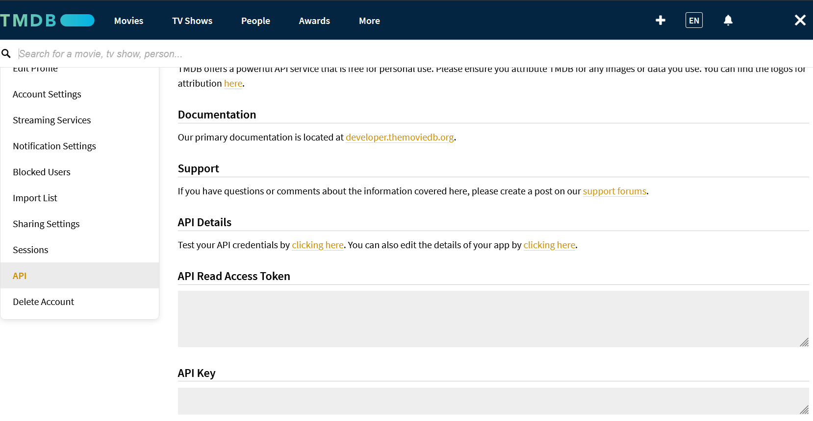
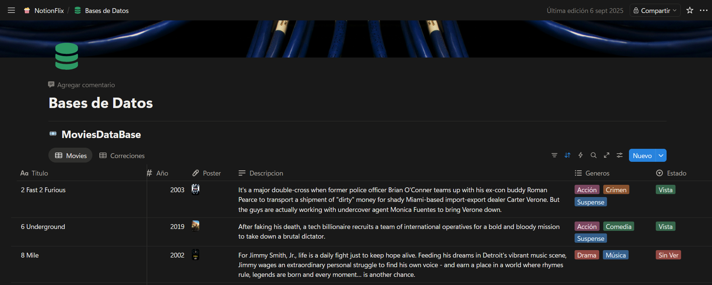
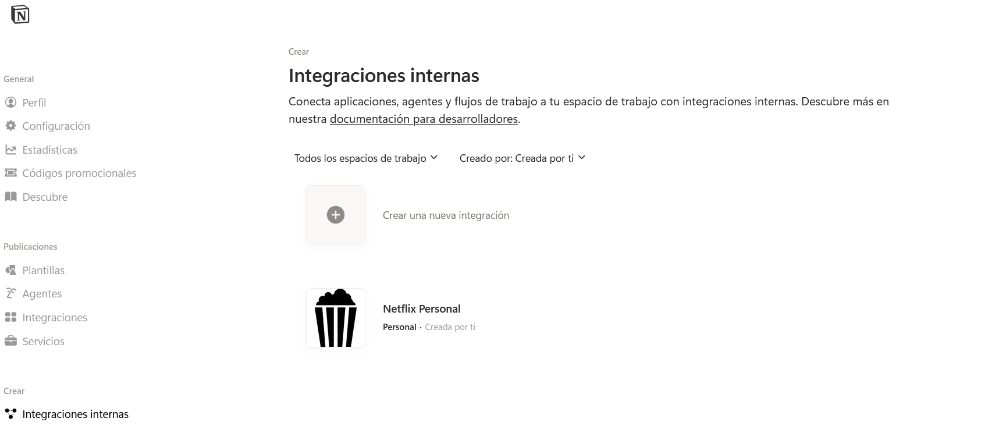
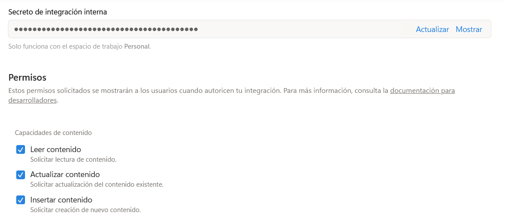
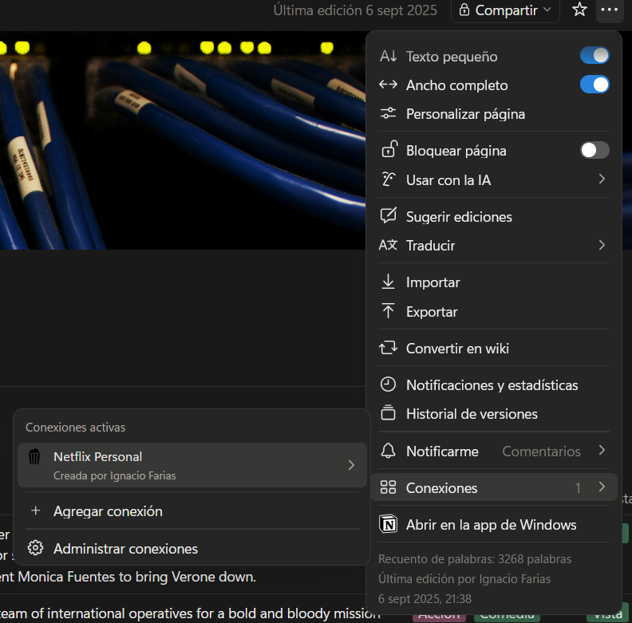

# 🎬 Notionflix

Automatización de carga de películas en Notion utilizando la API de TMDb.

---

## 🧠 Introducción

Hoy en día, la gestión manual de información en Notion puede resultar repetitiva e ineficiente. Este proyecto busca automatizar la carga de películas obteniendo metadatos detallados (posters, fechas, descripciones) desde una API externa de forma instantánea.

---

## 🎯 Objetivo

- **Automatizar** la carga de películas en una base de datos de Notion.
- **Integrar** APIs de terceros (TMDb) con el ecosistema de Notion.
- **Optimizar** el tiempo del usuario eliminando el trabajo manual de carga de datos.

---

## 🛠️ Tecnologías utilizadas

- **Lenguaje:** Python
- **APIs:** TMDb API & Notion API.
- **Librerías principales:** `requests`, `python-dotenv`.

---

## 🔑 Configuración de la API de TMDb

Para obtener información de las películas de forma automática, se utilizó la API de **The Movie Database**.

### 🧾 Pasos iniciales
1. Ingresar a [themoviedb.org](https://www.themoviedb.org/).
2. Crear una cuenta y verificar el correo.
3. Solicitar una **API Key** de tipo *Developer* en la sección de configuración.

> [!CAUTION]
> Esta clave es privada. No la compartas ni la subas directamente al código fuente. Utiliza variables de entorno.

### 📡 Endpoint y Parámetros
- **Endpoint:** `https://api.themoviedb.org/3/search/movie`
- **Parámetros:** `api_key` y `query` (nombre del film).
- **Posters:** Se obtienen concatenando la base `https://image.tmdb.org/t/p/w500/` con el `poster_path` obtenido en el JSON de respuesta.

---

## 🗂️ Configuración de la base de datos en Notion

Se diseñó una estructura específica en Notion para que los datos coincidan con la respuesta de la API.

### 🧩 Propiedades de la base de datos
| Propiedad | Tipo | Descripción |
| :--- | :--- | :--- |
| **Nombre** | Title | Título original de la película |
| **Año** | Number o Date | Año de lanzamiento |
| **Descripción** | Text | Resumen o sinopsis (Overview) |
| **Poster** | Files & Media | Imagen de portada de la película |
| **Géneros** | Multi-select | Categorías (Acción, Drama, etc.) |
| **Estado** | Select | Estado personal (Vista, Pendiente) |

---

## 🔐 Configuración de la API de Notion

1. **Crear Integración:** Ve a [Notion My-Integrations](https://www.notion.so/my-integrations) y genera un **Internal Integration Token**.
   
   
2. **Conectar:** En la página de tu base de datos en Notion, ve a los tres puntos (...) > **Add connections** y busca tu integración.
   
3. **ID de Base de Datos:** Se obtiene de la URL de tu base de datos: `https://www.notion.so/ID_DE_LA_BASE?v=...` (es el código alfanumérico antes del signo de pregunta).

---
---

# 📂 Documentación Técnica: Arquitectura y Funciones

Este documento detalla la lógica interna, la estructura de módulos y el propósito de cada función dentro del sistema **Notionflix**.

---

## 🏗️ Arquitectura del Sistema

El proyecto sigue un diseño modular para separar las responsabilidades de conexión (APIs externas), gestión de datos y lógica de negocio.

1. **Configuración:** Centraliza credenciales (`config.py`).
2. **Proveedores de Datos:** Interfaz con la API de cine (`tmdb.py`).
3. **Gestores de Destino:** Manipulación de la base de Notion (`notion.py` y `person.py`).
4. **Orquestador:** Ejecución y coordinación del flujo (`main.py`).

---

## 🛠️ Detalle de Módulos y Funciones

### 📄 `config.py`
**Responsabilidad:** Repositorio de constantes y credenciales.
* No contiene funciones lógicas. Define variables globales como `TMDB_API_KEY`, `NOTION_TOKEN` e IDs de bases de datos. Se recomienda el uso de variables de entorno por seguridad.

---

### 📄 `tmdb.py`
**Responsabilidad:** Comunicación con la API de The Movie Database.

* **`_get(endpoint, params)`**: Función privada auxiliar. Centraliza las peticiones GET, añade la API Key y maneja errores de red.
* **`search_movie(title, year, max_results, interactive)`**: Busca películas. Si hay ambigüedad y `interactive=True`, permite al usuario elegir la película correcta desde la consola.
* **`get_genres()`**: Descarga los géneros oficiales y crea un diccionario `{id: nombre}` para mapearlos en Notion.
* **`get_movie(movie_id)`**: Obtiene metadatos detallados (necesario para detectar colecciones/sagas).
* **`get_collection(collection_id)`**: Recupera información y lista de películas de una saga específica.
* **`get_credits(movie_id)`**: Obtiene el listado de actores (cast) y equipo técnico (crew).
* **`get_person(person_id)`**: Obtiene biografía e imagen de perfil de un actor o director.

---

### 📄 `notion.py`
**Responsabilidad:** Gestión de bases de datos y páginas en el workspace de Notion.

* **`_request(method, endpoint, json)`**: Motor central de peticiones para Notion. Maneja autenticación y métodos HTTP (POST, PATCH, GET).
* **`get_pages(db_id)`**: Recupera todos los registros de una base de datos manejando automáticamente la paginación.
* **`update_page(page_id, properties)`**: Actualiza información de una página existente mediante `patch`.
* **`get_database_schema(db_id)`**: Consulta los IDs internos de las columnas de la base de datos para asegurar compatibilidad.
* **`find_by_name(db_id, name, title_prop)`**: Localiza una página por su título para evitar crear duplicados.
* **`create_collection_page(...)`**: Inserta una nueva página en la base de "Sagas" con descripción y arte.
* **`create_movie_page(...)`**: Construye el payload complejo para insertar una película con todos sus metadatos.

---

### 📄 `person.py`
**Responsabilidad:** Gestión de la entidad "Persona" y sus relaciones relacionales.

* **`get_person_schema(db_id)`**: Obtiene el esquema técnico de la base de datos de personas.
* **`find_person_by_name(db_id, name)`**: Verifica si un actor o director ya existe en Notion.
* **`create_person_page(...)`**: Crea una ficha nueva con nombre, rol y fotografía externa.
* **`build_person_relations(...)`**: Orquesta la creación masiva de personas y devuelve una lista de IDs para crear el enlace de "Relación" en Notion.

---

### 📄 `main.py`
**Responsabilidad:** Orquestador de flujo de trabajo (Lógica de Negocio).

* **`extract_title(page)`**: Limpia y extrae el texto del título de una página de Notion.
* **`has_poster(page, prop_map)`**: Verifica si una película ya fue procesada para evitar duplicar el consumo de API.
* **`build_properties(...)`**: Transforma los datos de TMDb al formato JSON estricto que requiere Notion.
* **`handle_collection(...)`**: Lógica de Sagas. Asegura que la colección exista y vincula todas sus películas automáticamente.
* **`mostrar_resumen(...)`**: Imprime un reporte estadístico visual (éxitos, fallos, creadas) al finalizar el script.
* **`main()`**: Punto de entrada principal que coordina el escaneo inicial y el enriquecimiento de datos.

---

## 🛠️ Detalles de Implementación Técnica
* **Imágenes Externas:** Se vinculan mediante URLs de TMDb para optimizar el rendimiento y no ocupar almacenamiento interno en Notion.
* **PropMap Dinámico:** El sistema consulta el esquema de la base de datos en tiempo real, lo que permite cambiar nombres de columnas en Notion sin romper el código.
